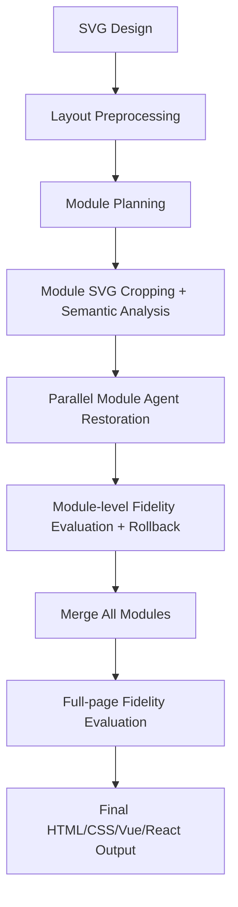

# SVG to HTML

[简体中文](README.md) | English

High-fidelity design-to-code for enterprise frontend teams. Convert design SVGs into real, maintainable HTML/CSS (with Vue / React support) and produce a measurable fidelity report.

## Preview

Below is a visual comparison between the original design render and the generated page render. This run has a **4.33% visual difference**, or roughly **95.67% fidelity**.


| Original Design Render | Generated Page Render | Visual Difference |
| --- | --- | --- |
|  |  |  |

> Full interactive comparison page: [`example/comparison-4.33.html`](example/comparison-4.33.html)

## Features

- **High-fidelity output** — Quantifies visual differences between the original design and generated page, then uses that report to drive auto-repair
- **Real HTML/CSS output** — Produces semantic DOM structure, not embedded SVGs
- **Multiple output formats** — HTML, Vue, and React component output
- **DOM text preservation** — Keeps visible text as real DOM text nodes
- **Modular generation** — Splits large designs into semantic modules for parallel generation
- **Smart preprocessing** — Pre-extracts text (OCR), layout boxes, colors, icons, backgrounds
- **Fidelity loop** — Module-level and full-page visual comparison feedback with auto-repair
- **Auto rollback** — Automatically rolls back to the best snapshot when fidelity degrades
- **Web UI + CLI** — Browser interface for uploads and a full set of CLI tools

## Quick Start

### One-click Deploy (Linux / macOS)

```bash
bash backend/scripts/deploy.sh
```

This script handles everything: system dependencies, Node.js, pnpm, browser, project setup, and service startup.

### Manual Setup

```bash
# 1. Install dependencies
pnpm install

# 2. Check environment
pnpm run doctor

# 3. Configure model provider
cp backend/config/model-provider.example.json backend/config/model-provider.json
# Edit backend/config/model-provider.json with your provider details

# 4. Build MCP server (required for browser-based verification)
pnpm run build:mcp

# 5. Start the service
pnpm start
# Open http://localhost:80/transformer
```

### Service Management

```bash
bash backend/scripts/start-linux.sh start     # Start in background
bash backend/scripts/start-linux.sh stop      # Stop
bash backend/scripts/start-linux.sh restart   # Restart
bash backend/scripts/start-linux.sh status    # Show status
bash backend/scripts/start-linux.sh logs      # Follow logs
bash backend/scripts/start-linux.sh foreground  # Run in foreground with auto-restart
```

## Requirements

| Dependency | Version | Notes |
| --- | --- | --- |
| Node.js | 20+ (recommended 22+) | |
| pnpm | 10.11+ | Specified in `packageManager` field |
| Chrome / Chromium / Edge | Latest | For rendering & screenshots |
| opencode CLI | Optional | For `opencode` runtime |

The install script (`backend/scripts/install-linux.sh`) can automatically install all of the above on Linux and macOS.

## Configuration

### Model Provider

Edit `backend/config/model-provider.json` (copy from `backend/config/model-provider.example.json`):

```json
{
  "moduleAgentModel": "your-model",
  "otherModel": "your-model",
  "models": {
    "your-model": {
      "runtime": "opencode",
      "wireApi": "chat-completions",
      "provider": "your-provider",
      "baseURL": "https://api.example.com/v1",
      "apiKeyEnv": "YOUR_PROVIDER_API_KEY",
      "model": "your-model-id"
    }
  }
}
```

`wireApi` accepts `chat-completions` (default, OpenAI-compatible), `responses` (OpenAI Responses), or `anthropic` (Anthropic).

### Environment Variables

All settings can be configured via the `.env` file. Key variables:

| Variable | Default | Description |
| --- | --- | --- |
| `PORT` | `80` | HTTP listen port |
| `WORKSPACE` | `./workspace` | Session artifacts root |
| `NODE_ENV` | `development` | Runtime environment |
| `MAX_CONCURRENT_AGENTS` | `2` | Concurrent session limit |
| `MAX_PARALLEL_MODULE_AGENTS` | `5` | Parallel modules per session |
| `CDP_OPERATION_CONCURRENCY` | `1` | Browser screenshot / page evaluate concurrency limit |
| `DIFF_RATIO_THRESHOLD` | `0.05` | Full-page visual-difference pass threshold (5%; lower means higher fidelity) |
| `CHROMIUM_PATH` | auto-detect | Browser binary path |
| `SESSION_CHAT_DISABLED` | `1` | Disable the chat repair UI and backend message endpoint |
| `SESSION_DELETE_DISABLED` | `0` | Disable session deletion |

See `.env` for the full list.

## CLI Tools

```bash
# Generate (preflight: layout analysis + scaffold + module plan)
pnpm run task:generate -- <svg-path> --format html|vue|react

# Generate a page-level fidelity report
pnpm run task:verify -- <svg-path>

# Generate a module-level fidelity report
pnpm run task:verify-module -- --module-dir <dir> --module-id <id> ...

# Split design into modules
pnpm run task:split-svg-modules -- <svg-path>

# Environment check
pnpm run doctor

# Type check
pnpm run lint:types

# Build the React frontend
pnpm run build:frontend
```

## How It Works



## Project Structure

```
backend/
  src/                    Express backend, CLI, generation pipeline, and agent orchestration
  config/                 Model provider configuration
  scripts/                Install, deploy, and diagnostic scripts
  tests/                  Backend unit tests
frontend/
  src/                    React 18 frontend source
  public/                 Built static assets served directly by the backend
example/                  Publishable fidelity comparison examples
workspace/                Generated sessions and artifacts (git-ignored)
```

## License

[MIT](LICENSE)
