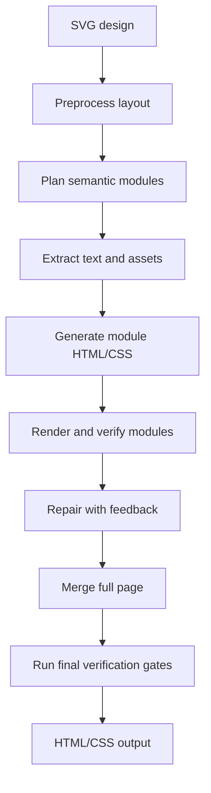

# SVG to HTML

[简体中文](README.md) | English

Pixel-level restoration from design SVGs to real, maintainable HTML/CSS.

SVG to HTML takes an exported SVG design, extracts layout/text/assets, asks
model agents to rebuild the page as semantic HTML/CSS, then verifies the result
with render diff, OCR checks, text geometry, layout lint, module-region diffs,
and final-output policy gates. The goal is to push the generated page as close
as possible to the source design at the pixel level.

It is built for cases where "just embed the SVG" is not enough: landing pages,
UI mockups, long design exports, component previews, and visual restorations
that need editable DOM text and reusable structure.

## Preview

This example compares the original SVG render with the generated HTML render.
The measured pixel diff for this run is **4.33%**.


The source SVG for this example is
[`example/Group 2147208102.svg`](example/Group%202147208102.svg), from the
default project template on Tencent Ardot: <https://ardot.tencent.com/>.

| Original SVG                                                      | Generated HTML                                                    | Pixel Diff                                             |
| ----------------------------------------------------------------- | ----------------------------------------------------------------- | ------------------------------------------------------ |
|  |  |  |

Open the full comparison page:

```text
example/comparison-4.33.html
```

## Features

- Targets pixel-level restoration by comparing SVG renders with HTML renders
  and using diff feedback to drive repairs.
- Converts SVG design exports into real HTML/CSS instead of wrapping the source
  SVG as a visual layer.
- Keeps ordinary visible text as DOM text whenever possible.
- Splits large designs into semantic modules before generation.
- Pre-extracts OCR text, layout boxes, colors, icons, backgrounds, and module
  summaries to reduce model guesswork.
- Runs local and full-page verification loops with pixel diff feedback.
- Supports rollback to the best verified module snapshot.
- Provides a browser UI and CLI commands for generation, verification, and
  framework export.
- Can export restored output as plain HTML and module-oriented React/Vue
  artifacts.

## How It Works



The main idea is to combine deterministic extraction with model generation:
scripts measure what can be measured, agents rebuild what needs judgment, and
verification keeps the result anchored to the source design.

## Requirements

- Node.js 20+
- pnpm 10+
- Chrome, Chromium, or Microsoft Edge available on the machine for rendering and
  screenshots
- A model provider compatible with the configured runtime
- Optional OCR support:
  - macOS can use Apple Vision through the local OCR path
  - Windows/Linux can use Tesseract with `chi_sim+eng` language data
- If you use the `kimi` runtime, install the official Kimi CLI separately, or
  set `KIMI_CLI_PATH`

`pnpm install` only installs Node.js dependencies from `package.json`. It cannot
install browsers, Tesseract, or Kimi CLI for you. A warning-only system
dependency check runs after install; you can also run it manually:

```bash
pnpm doctor
```

On Windows, this helper can install Chrome and Tesseract through `winget`:

```powershell
powershell -ExecutionPolicy Bypass -File scripts/install-system-deps.ps1
```

Note: Windows has not been fully tested yet. The project includes Windows path
detection and a helper install script, but the full pipeline may still be
unavailable or require manual adjustments.

Kimi CLI still needs to be installed through the official Kimi distribution.
After installing it, make sure `kimi` is in `PATH`, or set:

```powershell
$env:KIMI_CLI_PATH = "C:\path\to\kimi.exe"
```

## Quick Start

Install dependencies:

```bash
pnpm install
```

If `postinstall` reports missing system dependencies, install them and then run
`pnpm doctor` again.

Create a local model config:

```bash
cp config/model-provider.example.json config/model-provider.json
```

Edit `config/model-provider.json` with your provider URL, API key, and model
name. You can also override the provider with environment variables:

```bash
export MODEL_BASE_URL="<responses-compatible-base-url>"
export MODEL_API_KEY="<provider-token>"
```

Start the web app on a non-privileged local port:

```bash
PORT=3400 pnpm start
```

Open:

```text
http://localhost:3400/transformer
```

Upload an SVG design and follow the generated session in the UI.

## CLI Usage

Generate a restored page:

```bash
pnpm exec tsx src/cli/generate-design.ts workspace/sessions/<session>/<design>.svg
```

Verify a generated page:

```bash
pnpm exec tsx src/cli/verify-design.ts workspace/sessions/<session>/<design>.svg
```

Run a faster visual check:

```bash
pnpm exec tsx src/cli/verify-design.ts workspace/sessions/<session>/<design>.svg --fast
```

Split a design into modules:

```bash
pnpm exec tsx src/cli/split-svg-modules.ts workspace/sessions/<session>/<design>.svg
```

Export framework artifacts:

```bash
pnpm exec tsx src/cli/export-framework.ts workspace/sessions/<session>/<design>.svg
```

Type-check the project:

```bash
pnpm exec tsc --noEmit
```

When a session has module-region diff data, pass it to verification:

```bash
pnpm exec tsx src/cli/verify-design.ts workspace/sessions/<session>/<design>.svg \
  --regions workspace/sessions/<session>/artifacts/modules/module-regions.diff.json
```

## Model Configuration

Model providers are configured in `config/model-provider.json`.

The example config includes two runtime styles:

- `codex`: Codex SDK based runtime using a Responses-compatible provider.
- `kimi`: Kimi CLI runtime using a chat-style provider.

Common environment overrides:

```bash
export MODEL_CONFIG_ID=codex
export MODEL_BASE_URL="<provider-base-url>"
export MODEL_API_KEY="<provider-api-key>"
```

Provider-specific keys such as `KIMI_API_KEY` are also supported by their
runtime adapters.

## Project Structure

```text
src/
  cli/                    CLI entry points
  config/                 Runtime, model, and verification settings
  core/                   SVG parsing, rendering, diffing, OCR, lint, policy
  pipeline/               Agent orchestration, module generation, merge, verify
  routes/                 Express API routes
  session-store/          Session state, events, snapshots, messages
public/                   Web UI
prompts/                  Restoration rules and agent prompts
example/                  Publishable examples and screenshots
workspace/                Local sessions and generated artifacts
```

`workspace/` is local output and is ignored by git. Generated sessions can be
large because they include rendered screenshots, extracted assets, reports, and
intermediate module files.

## Output Policy

The verifier enforces a few important restoration rules:

- The final page must be real HTML/CSS, not an embedded original SVG viewer.
- Ordinary readable UI text should be DOM text, not baked into screenshots.
- Text geometry should be solved with normal typography and layout, not
  transform scaling.
- Complex bounded assets, icons, decorative shells, and text-free backgrounds
  may be exported from SVG nodes.
- Repeated visual groups should be restored as lists, grids, rows, cards, or
  reusable module structures where possible.

## Limitations

This project is a restoration tool, not a magic design compiler. Some cases
still need follow-up repair:

- Fonts that are unavailable locally can shift text metrics.
- Heavy masks, blur, glass effects, and complex blend modes may need asset
  extraction or manual tuning.
- OCR can still misread small or stylized text.
- Very large SVGs can require several model/verify rounds and may be expensive
  depending on the configured provider.

## Development

Run the TypeScript checker:

```bash
pnpm exec tsc --noEmit
```

Useful local files:

- `config/model-provider.example.json`: model configuration template
- `prompts/`: restoration constraints injected into agents
- `example/comparison-4.33.html`: publishable comparison example

## License

MIT
