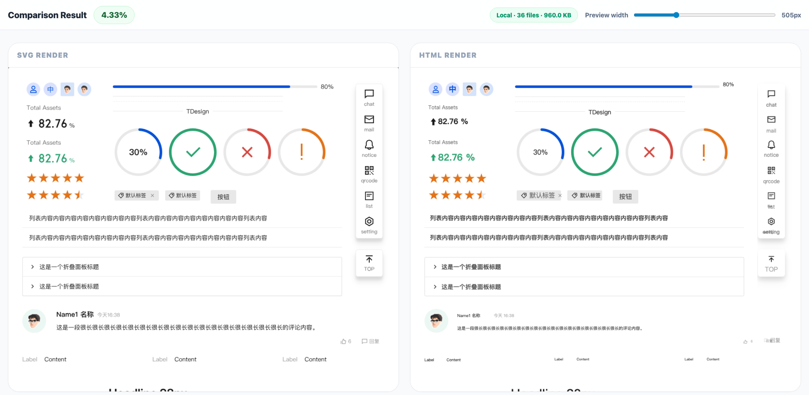
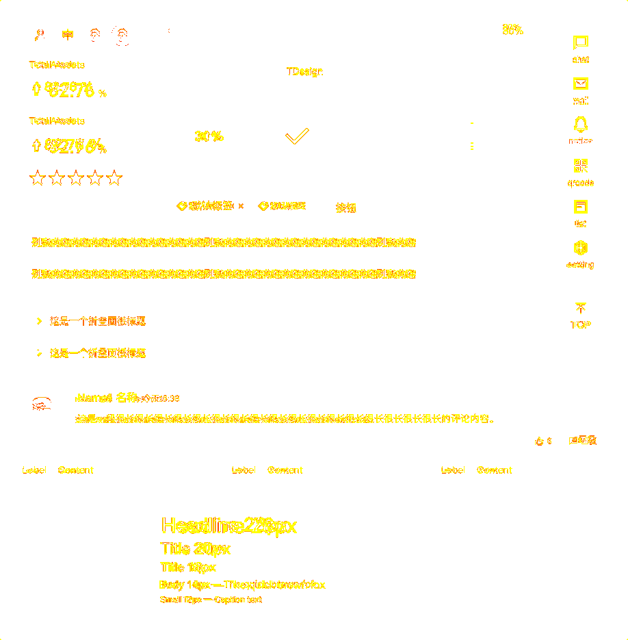
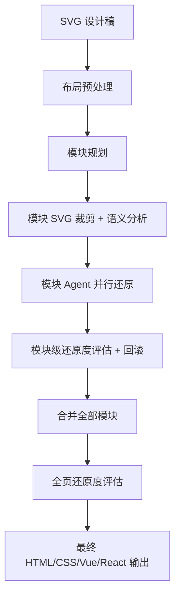

# SVG to HTML

简体中文 | [English](README.en.md)

面向企业前端团队的高还原度设计稿转代码工具。将 SVG 设计稿还原为真实、可维护的 HTML/CSS 页面（同时支持 Vue / React 输出），并生成可量化的还原度报告。

## 效果预览

以下示例展示了原始设计稿渲染与生成页面渲染的视觉对比。本次视觉差异为 **4.33%**，还原度约 **95.67%**。



| 原始设计稿渲染 | 生成页面渲染 | 视觉差异图 |
| --- | --- | --- |
|  |  |  |

> 完整交互对比页面：[`example/comparison-4.33.html`](example/comparison-4.33.html)

## 特性

- **高还原度输出** — 通过设计稿对比报告量化原始设计稿与生成页面的视觉差异，并驱动自动修复
- **真实 HTML/CSS 输出** — 还原为语义化 DOM 结构，而非嵌入 SVG
- **多格式输出** — 支持 HTML、Vue、React 组件输出
- **DOM 文本保留** — 可读文本保留为真实 DOM 文本节点
- **模块化生成** — 大型设计稿自动拆分为语义模块，并行生成
- **智能预处理** — 预提取文本（OCR）、布局框、颜色、图标、背景
- **还原度闭环** — 模块级 + 全页级视觉对比反馈，自动修复
- **自动回滚** — 还原度退化时自动回滚到最优快照
- **Web UI + CLI** — 提供浏览器界面和完整 CLI 工具集

## 快速开始

### 一键部署（Linux / macOS）

```bash
bash backend/scripts/deploy.sh
```

该脚本自动完成：系统依赖安装、Node.js、pnpm、浏览器、项目依赖和服务启动。

### 手动部署

```bash
# 1. 安装依赖
pnpm install

# 2. 环境检查
pnpm run doctor

# 3. 配置模型
cp backend/config/model-provider.example.json backend/config/model-provider.json
# 编辑 backend/config/model-provider.json 填入 provider 信息

# 4. 构建 MCP server（浏览器验证所需）
pnpm run build:mcp

# 5. 启动服务
pnpm start
# 访问 http://localhost:80/transformer
```

### 服务管理

```bash
bash backend/scripts/start-linux.sh start       # 后台启动
bash backend/scripts/start-linux.sh stop        # 停止
bash backend/scripts/start-linux.sh restart     # 重启
bash backend/scripts/start-linux.sh status      # 查看状态
bash backend/scripts/start-linux.sh logs        # 查看日志
bash backend/scripts/start-linux.sh foreground  # 前台运行（带自动重启保护）
```

## 环境要求

| 依赖 | 版本 | 说明 |
| --- | --- | --- |
| Node.js | 20+（推荐 22+） | |
| pnpm | 10.11+ | 项目 `packageManager` 字段指定 |
| Chrome / Chromium / Edge | 最新版 | 用于渲染和截图 |
| opencode CLI | 可选 | 用于 `opencode` runtime |

安装脚本 `backend/scripts/install-linux.sh` 可在 Linux 和 macOS 上自动安装以上全部依赖。

## 配置

### 模型配置

编辑 `backend/config/model-provider.json`（从 `backend/config/model-provider.example.json` 复制）：

```json
{
  "moduleAgentModel": "your-model",
  "otherModel": "your-model",
  "models": {
    "your-model": {
      "runtime": "opencode",
      "wireApi": "chat-completions",
      "provider": "your-provider",
      "baseURL": "https://api.example.com/v1",
      "apiKeyEnv": "YOUR_PROVIDER_API_KEY",
      "model": "your-model-id"
    }
  }
}
```

`wireApi` 可选值：`chat-completions`（默认，OpenAI-compatible）、`responses`（OpenAI Responses）、`anthropic`（Anthropic）。

### 环境变量

所有配置可通过 `.env` 文件设置，关键变量：

| 变量 | 默认值 | 说明 |
| --- | --- | --- |
| `PORT` | `80` | HTTP 监听端口 |
| `WORKSPACE` | `./workspace` | Session 产物根目录 |
| `NODE_ENV` | `development` | 运行环境 |
| `MAX_CONCURRENT_AGENTS` | `2` | 同时运行的 session 数 |
| `MAX_PARALLEL_MODULE_AGENTS` | `5` | 单 session 并行模块数 |
| `CDP_OPERATION_CONCURRENCY` | `1` | 浏览器截图 / 页面 evaluate 并发上限 |
| `DIFF_RATIO_THRESHOLD` | `0.05` | 全页视觉差异通过阈值（5%，数值越低还原度越高） |
| `CHROMIUM_PATH` | 自动检测 | 浏览器二进制路径 |
| `SESSION_CHAT_DISABLED` | `1` | 禁用聊天修复入口和后端消息接口 |
| `SESSION_DELETE_DISABLED` | `0` | 禁用删除 session |

完整列表见 `.env` 文件。

## CLI 工具

```bash
# 生成（preflight：布局分析 + scaffold + 模块规划）
pnpm run task:generate -- <svg-path> --format html|vue|react

# 生成页面级还原度报告
pnpm run task:verify -- <svg-path>

# 生成模块级还原度报告
pnpm run task:verify-module -- --module-dir <dir> --module-id <id> ...

# 拆分模块
pnpm run task:split-svg-modules -- <svg-path>

# 环境诊断
pnpm run doctor

# 类型检查
pnpm run lint:types

# 前端 React 构建
pnpm run build:frontend
```

## 工作原理



## 项目结构

```
backend/
  src/                    Express 后端、CLI、生成流水线和 Agent 编排
  config/                 模型配置
  scripts/                安装、部署和诊断脚本
  tests/                  后端单元测试
frontend/
  src/                    React 18 前端源码
  public/                 React build 后的静态产物，供后端直接服务
example/                  可发布的还原度对比示例
workspace/                生成的 session 和产物（git 忽略）
```

## License

[MIT](LICENSE)
