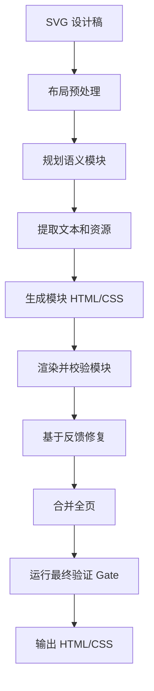

# SVG to HTML

简体中文 | [English](README.en.md)

把设计 SVG 像素级还原成真实、可维护的 HTML/CSS。

SVG to HTML 会读取导出的 SVG 设计稿，提取布局、文本、资源和模块信息，调用模型 agent 重建语义化 HTML/CSS，然后用渲染 diff、OCR、文本几何、布局检查、模块区域 diff 和最终产物策略 Gate 做验证，目标是尽可能接近源设计稿的像素级视觉效果。

它适合那些「不能直接把 SVG 塞进页面」的场景：落地页、UI 设计稿、长页面导出、组件预览、需要可编辑 DOM 文本和可维护结构的视觉还原。

## 效果预览

下面是一个原始 SVG 渲染和生成 HTML 渲染的对比样例，本次运行的像素 diff 为 **4.33%**。


这个示例的源 SVG 是 [`example/Group 2147208102.svg`](example/Group%202147208102.svg)，来源于腾讯 Ardot 的默认项目模板：<https://ardot.tencent.com/>。

| 原始 SVG 渲染                                                     | 生成 HTML 渲染                                                    | 像素 Diff                                              |
| ----------------------------------------------------------------- | ----------------------------------------------------------------- | ------------------------------------------------------ |
|  |  |  |

也可以直接打开完整对比页：

```text
example/comparison-4.33.html
```

## 特性

- 面向像素级还原：用 SVG 渲染截图和 HTML 渲染截图做对比，以 diff 结果驱动修复。
- 把 SVG 设计稿还原为真实 HTML/CSS，而不是把原始 SVG 包成整页视觉层。
- 普通可读文本尽量保留为 DOM 文本。
- 大型设计稿会先拆成语义模块，再分模块生成。
- 预提取 OCR 文本、布局框、颜色、图标、背景和模块摘要，减少模型猜测。
- 支持模块级和全页级验证闭环，用像素 diff 反馈推动修复。
- 支持回滚到历史最佳模块快照。
- 提供浏览器 UI 和 CLI，可用于生成、验证和框架产物导出。
- 可导出普通 HTML，也可按模块导出 React/Vue 方向的产物。

## 工作原理



核心思路是把确定性脚本和模型生成结合起来：能测量的先由程序测量，需要判断的交给模型生成，最后由验证系统把结果持续拉回源设计稿。

## 环境要求

- Node.js 20+
- pnpm 10+
- 本机可用的 Chrome、Chromium 或 Microsoft Edge，用于页面渲染和截图
- 一个与当前 runtime 兼容的模型 provider
- 可选 OCR 支持：
  - macOS 可走本地 Apple Vision
  - Windows/Linux 可使用 Tesseract，并需要 `chi_sim+eng` 语言数据
- 如果使用 `kimi` runtime，需要单独安装官方 Kimi CLI，或设置 `KIMI_CLI_PATH`

`pnpm install` 只会安装 `package.json` 里的 Node.js 依赖，不能替你安装浏览器、Tesseract 或 Kimi CLI。安装后会自动运行一次 warning-only 的系统依赖检查，也可以手动执行：

```bash
pnpm doctor
```

Windows 可以先用辅助脚本安装浏览器和 Tesseract：

```powershell
powershell -ExecutionPolicy Bypass -File scripts/install-system-deps.ps1
```

注意：Windows 环境目前还没有完整测试过。项目里已经补了 Windows 路径探测和辅助安装脚本，但实际运行可能仍有不可用或需要手动调整的地方。

Kimi CLI 需要按官方方式单独安装；安装后请确保 `kimi` 在 `PATH` 中，或设置：

```powershell
$env:KIMI_CLI_PATH = "C:\path\to\kimi.exe"
```

## 快速开始

安装依赖：

```bash
pnpm install
```

如果 `postinstall` 提示缺少系统依赖，按上面的环境要求安装后再运行 `pnpm doctor` 确认。

创建本地模型配置：

```bash
cp config/model-provider.example.json config/model-provider.json
```

编辑 `config/model-provider.json`，填入 provider URL、API key 和模型名。也可以用环境变量覆盖：

```bash
export MODEL_BASE_URL="<responses-compatible-base-url>"
export MODEL_API_KEY="<provider-token>"
```

用非特权端口启动 Web 应用：

```bash
PORT=3400 pnpm start
```

打开：

```text
http://localhost:3400/transformer
```

上传 SVG 设计稿后，可以在页面里查看 session 的生成、验证和修复进度。

## CLI 用法

生成还原页面：

```bash
pnpm exec tsx src/cli/generate-design.ts workspace/sessions/<session>/<design>.svg
```

验证生成结果：

```bash
pnpm exec tsx src/cli/verify-design.ts workspace/sessions/<session>/<design>.svg
```

运行更快的视觉检查：

```bash
pnpm exec tsx src/cli/verify-design.ts workspace/sessions/<session>/<design>.svg --fast
```

拆分设计稿模块：

```bash
pnpm exec tsx src/cli/split-svg-modules.ts workspace/sessions/<session>/<design>.svg
```

导出框架产物：

```bash
pnpm exec tsx src/cli/export-framework.ts workspace/sessions/<session>/<design>.svg
```

类型检查：

```bash
pnpm exec tsc --noEmit
```

如果 session 里有模块区域 diff 数据，验证时可以传入：

```bash
pnpm exec tsx src/cli/verify-design.ts workspace/sessions/<session>/<design>.svg \
  --regions workspace/sessions/<session>/artifacts/modules/module-regions.diff.json
```

## 模型配置

模型 provider 通过 `config/model-provider.json` 配置。

示例配置包含两类 runtime：

- `codex`：基于 Codex SDK，使用 Responses-compatible provider。
- `kimi`：基于 Kimi CLI，使用 chat-style provider。

常用环境变量覆盖：

```bash
export MODEL_CONFIG_ID=codex
export MODEL_BASE_URL="<provider-base-url>"
export MODEL_API_KEY="<provider-api-key>"
```

部分 runtime 也支持自己的 provider-specific key，比如 `KIMI_API_KEY`。

## 项目结构

```text
src/
  cli/                    CLI 入口
  config/                 运行时、模型和验证配置
  core/                   SVG 解析、渲染、diff、OCR、lint、policy
  pipeline/               Agent 编排、模块生成、合并、验证
  routes/                 Express API 路由
  session-store/          Session 状态、事件、快照、消息
public/                   Web UI
prompts/                  还原规则和 agent prompts
example/                  可发布的示例和截图
workspace/                本地 session 和生成产物
```

`workspace/` 是本地输出目录，已被 git 忽略。生成的 session 可能比较大，因为里面会包含渲染截图、提取资源、验证报告和模块中间产物。

## 输出策略

验证器会强制检查一些重要还原规则：

- 最终页面必须是真实 HTML/CSS，不能是嵌入原始 SVG 的 viewer。
- 普通可读 UI 文本应是 DOM 文本，不能烘焙进截图。
- 文本几何应使用正常排版和布局解决，不能靠 transform 缩放文本。
- 有明确边界的复杂资源、图标、装饰壳层、无文本背景可以从 SVG 节点导出。
- 重复视觉组应尽量恢复为列表、网格、行、卡片或可复用模块结构。

## 局限

这是一个还原工具链，不是魔法设计编译器。下面这些情况仍可能需要后续修复：

- 本机缺少设计稿字体时，文本度量会有偏差。
- 复杂 mask、blur、毛玻璃、混合模式可能需要资产提取或人工调优。
- OCR 可能误读很小或高度风格化的文字。
- 超大 SVG 可能需要多轮模型生成和验证，成本取决于你配置的 provider。

## 开发

运行类型检查：

```bash
pnpm exec tsc --noEmit
```

常用本地文件：

- `config/model-provider.example.json`：模型配置模板
- `prompts/`：注入 agent 的还原约束
- `example/comparison-4.33.html`：可发布的对比示例

## License

MIT
