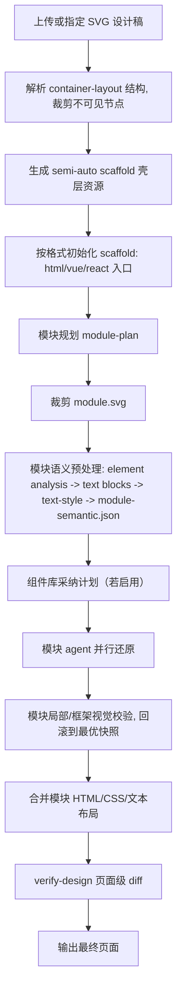
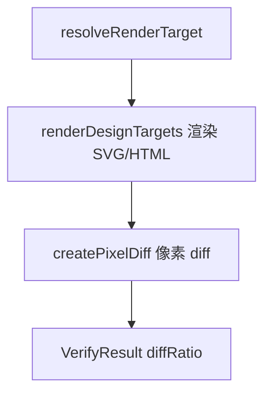

# SVG to HTML Toolkit

这是一个把 SVG 设计稿还原成真实 HTML/CSS（也支持 Vue / React）的工具链。流程会读取 `workspace/sessions/...` 下的设计 SVG，做结构解析、资源识别、模块规划、模块裁剪和模块语义预处理，然后调用大模型 agent 逐模块还原页面，再通过截图 diff 验证，最后把模块片段合并成最终页面。

服务端是 TypeScript ESM 应用。HTTP 入口在 `src/server.ts`，所有路由挂在 `/transformer` 前缀下，默认端口 `81`（可用 `PORT` 环境变量覆盖，工作目录可用 `WORKSPACE` 覆盖）。CLI 工具集中在 `src/cli/`。会话状态、设计稿、产物和报告统一写入 `workspace/`。Agent 提示词在 `src/prompts/`，模型与运行时选择在 `config/model-provider.json`。

## 常用命令

```bash
pnpm install
pnpm start                # 启动 HTTP 服务（默认 http://localhost:81/transformer）
pnpm run build:mcp        # 打包 MCP browser-eval server -> dist/browser-mcp-server.mjs
pnpm exec tsc --noEmit    # 类型检查
```

## CLI 工具

`src/cli/` 下提供了一组命令行入口，既可以单独调试预处理步骤，也可以跑完整 preflight / verify：

| 命令 | 说明 | 常用参数 |
|------|------|----------|
| `generate-design.ts` | 确定性 preflight：container-layout → semi-auto scaffold → 初始化格式入口 | `<svg-path>` `--format html\|vue\|react` `--scale <n>` `--force` |
| `verify-design.ts` | 页面级像素 diff | `<svg-path>` `--render-entry <html>` `--mode fast\|full` `--fast` `--scale <n>` |
| `verify-module-design.ts` | 模块级 local verify（封装 `module-local-verify`） | `--module-dir <dir>` `--module-id <id>` `--module-plan <path>` `--module-svg <path>` `--scaffold/--scaffold-html <path>` `--round <n>` `--scale <n>` |
| `split-svg-modules.ts` | 独立模块规划 | `<svg-path>` `--mode auto\|single\|vertical` `--planner auto\|script\|model` `--planner-retries <n>` `--min-gap <px>` `--scale <n>` `--artifact-dir <dir>` |
| `resolve-container-layout.ts` | 只跑 container-layout 解析 | `<svg-path>` `--scale <n>` |
| `compile-component-library.ts` | 编译 Vue / React 组件库 | `--source-dir <path>` **或** `--url <git-url>` `--framework vue\|react` `--force` `--skip-install` |
| `extract-module-text.ts` | 抽取模块文本块并写入 `module-semantic.json` | `--module-dir <dir>` `--module-id <id>` `--module-semantic <json>` `--module-svg <path>` `--scale <n>` |
| `inspect-module-svg.ts` | SVG 源码轻量检查 | `--module-dir <dir>` `--module-svg <path>` `--format json\|text` `--max-elements <n>` `--tag <tag,...>` |
| `export-svg-node-asset.ts` | 从 `module.svg` 导出单个/多个节点为 PNG 资产 | `--module-dir <dir>` `--output <assets/name.png>` `--index <n>` / `--selector <css>` / `--node-id <id>` `--padding <px>` `--scale <n>` `--asset-role <role>` `--register-semantic` |
| `browser-query.ts` | 开发调试：对模块渲染后的 fragment 执行 DOM 查询 | `<module-dir>` `--script '<js>'` `--script-file <file>` |
| `analyze-session-cost.ts` | 聚合多 session 的 token / 时间 / diff 指标 | `[session-id-or-dir...]` `--output-dir <dir>` |

`package.json` 提供对应的 `task:*` 脚本（如 `task:generate`、`task:verify`、`task:compile-component-library` 等），可直接 `pnpm run task:<name>` 调用。

`generate-design.ts` 是确定性的 preflight：它只生成结构产物和初始 scaffold，不是完成态还原。完整的 agent 还原通过 HTTP 服务的 session 流水线驱动。

`verify-design.ts` 只接受 `--render-entry` / `--render-entry-path`、`--mode fast|full`、`--fast`、`--scale`。它把 SVG 与 render entry 渲染成 PNG 并输出页面级像素 `diffRatio`。模块级区域 diff 在模块流水线内部完成（`agent-runner/module-local-verify.ts`、`module-framework-local-verify.ts`），verify CLI 不接受 `--regions`，传入会被当作未知参数报错。

## 整体流程

一次 session 分两个阶段：确定性 preflight 预处理，和模块流水线 agent 还原。



- preflight 由 `src/pipeline/agent-runner/preflight.ts` 编排，包含 6 步：`resolve container-layout` → `build semi-auto scaffold` → `scaffold initialize` → `plan adaptive modules` → `crop module svgs` → `publish preflight artifacts`。完成后会把所有产物路径写入 session result，便于中断恢复。
- 模块还原由 `src/pipeline/agent-runner/module-pipeline-v2.ts` 编排，模块之间并行执行，受 `MAX_PARALLEL_MODULE_AGENTS` 限制；受 `run-queue.ts` 全局 session 队列约束。
- 每个模块 agent turn 内支持 `verify-design` / `verify-module-design` / MCP `browser_eval` 命令，并自动根据 diff 改善/退化做备份与回滚。
- 若上传时指定了 `componentLibraryId`（仅 `vue`/`react`），会生成组件库上下文与采纳计划，模块产物需通过框架本地构建校验。

## 模块拆分策略

模块规划入口是 `src/core/svg-vertical-modules.ts`。

- 小尺寸 / 低复杂度页面（`isSmallLowComplexityDesign`）直接走单模块路线，整页作为 `module-01`。
- 其余情况且 `planner=auto`/`model` 时，调用模型 module planner（`src/core/module-planner/model-planner.ts`），通过校验后使用模型返回的语义模块区域。
- 模型 planner 失败，或显式 `planner=script` / `mode=single` 时，兜底为整页单模块。

对应产物（写入 `artifacts/modules/`）：

- `planner-request.json` / `planner-response.raw.txt` / `planner-response.json` / `planner-validation.json` / `planner-failure.json`
- `module-plan.json` / `module-plan.md`
- `module-regions.json` / `module-regions.diff.json` / `shared-layers.json`
- 模块规划质量报告（`src/core/module-plan-quality.ts` 生成）

## 模块语义预处理与还原

每个模块在交给 agent 前，会在 `module-pipeline-v2.ts` 里完成一轮语义预处理：

1. `analyzeModuleElements`：分析模块内 SVG 节点的可见性、bbox、导出决策。
2. text blocks（`src/core/module-text-blocks.ts` / `src/pipeline/agent-runner/module-semantic.ts`）：抽取模块文本块与坐标。
3. text-style inference（`src/core/text-style-inference.ts`）：基于 canvas 像素相似度推断文本样式声明。
4. `writeModuleSemanticPayload`：合并成 `module-semantic.json` 给 agent。

如果模块语义输入没有任何可用文本块、资产或可见节点，会被标记为 `module_input_failed`。

agent 单元（`src/pipeline/agent-runner/agent-unit.ts`）按模块持有独立 thread，并通过 `src/pipeline/agent-runner/agent-turn-core.ts` 执行多轮命令。模块 agent 的输入只包含 prompt 和本地路径清单，不由宿主直接注入 `module-semantic.json` 内容或图片附件；agent 需要按路径自行读取。模块初次生成后会做局部/视觉校验并记录可合并的最优快照；不再自动重跑。用户聊天修复会复用模块 thread，对指定单个模块执行一次后续修复（`runModuleUserRevision`）。

## 验证

`src/pipeline/verify.ts` 是页面级验证入口：渲染 SVG 与 render entry 为 PNG，执行像素 diff，返回 `diffRatio`。支持 `full`（默认）和 `fast` 两种模式。阈值定义在 `src/config/runtime.ts`：

- `DIFF_RATIO_THRESHOLD`（默认 0.05，环境变量覆盖）
- `MODULE_DIFF_RATIO_THRESHOLD`（默认 0.05，环境变量覆盖）
- `PNG_RASTER_SCALE_MULTIPLIER`（默认 2）



页面级 verify 只负责视觉像素 diff，不做页面文本内容比对或文本几何校验。模块级区域 diff 在模块流水线内部完成；Vue / React 输出还会经过真实 Vite 构建的框架本地校验（`module-framework-local-verify.ts`）。

## 浏览器 / CDP 基础设施

截图、diff、MCP `browser_eval` 都依赖 Chrome / Edge 浏览器二进制：

- 浏览器二进制按 `CHROMIUM_PATH` → `CHROME_PATH` → `BROWSER_PATH` → 自动探测的顺序解析。
- Linux x64 环境建议使用官方 `google-chrome-stable`，`scripts/install-linux.sh` 会优先安装官方 Chrome；也可以手动设置 `CHROMIUM_PATH=/usr/bin/google-chrome-stable`。部分发行版仓库 Chromium 可能对 SVG `<defs>`/`pattern` 资源节点返回非预期 bbox，导致语义 probe 误判资源节点为可渲染节点。
- `src/core/cdp.ts` 负责 CDP 客户端、浏览器进程池与页面截图。
- `src/core/browser-session.ts` 为每个模块维护持久 CDP tab，用于低延迟 DOM 探测。
- `src/core/static-server.ts` 提供本地静态文件服务池，供渲染与 diff 使用。
- 环境开关：`BROWSER_POOL_DISABLED`、`BROWSER_POOL_IDLE_MS`、`STATIC_SERVER_POOL_DISABLED`、`STATIC_SERVER_POOL_IDLE_MS`、`CDP_SEND_TIMEOUT_MS`、`CDP_READY_TIMEOUT_MS`。
- SVG 可见性剪枝：`SVG_VISIBILITY_PRUNE=1` 开启，`SVG_VISIBILITY_PRUNE_MAX_CANDIDATES` 控制候选数量。

## 多格式输出

- `html`：最终产物为 `<design>.html`，source entry 与 render entry 相同。
- `vue`：source entry 为 `<design>.vue`，产物经 Vite 构建后输出到 `artifacts/framework-render/vue/`，最终 render entry 仍是 `<design>.html`。
- `react`：source entry 为 `<design>.tsx`，样式为 `<design>.css`，构建输出到 `artifacts/framework-render/react/`，最终 render entry 为 `<design>.html`。

模块内的 source fragment 命名：`source.fragment.vue.html`（Vue） / `source.fragment.jsx`（React） / `preview.fragment.html`（HTML）。

## MCP browser_eval Server

`src/mcp/browser-mcp-server.ts` 构建后生成 `dist/browser-mcp-server.mjs`，由 opencode runtime 作为 MCP server 启动：

```bash
pnpm run build:mcp
```

暴露一个工具 `browser_eval`：

- `moduleDir`：模块目录绝对路径。
- `script`：在页面上下文中执行的 JavaScript，需 `return` JSON-serializable 值。

内部持有常驻 `BrowserSession`，每个模块一个 tab，执行前会自动 reload 以反映最新的 `preview.fragment.html` / `module.css`。agent 在 turn 内调用该工具后，系统会自动归档检查点。

## 多运行时与模型配置

当前代码仅实现了 `opencode` runtime（`src/pipeline/agent-runtime/`）。`config/model-provider.json` 通过 `moduleAgentModel` 选择模块生成/修复 agent 的模型，通过 `otherModel` 选择模块规划、语义视觉分类、组件库 descriptor 等其它 agent 的模型；推荐在配置文件中使用 `apiKeyEnv` 而不是明文 `apiKey`。

角色区分：`moduleAgent`（模块生成/修复）、`text`（其它文本任务）和 `vision`（其它视觉相关任务）。可用以下 `MODULE_AGENT_*` / `TEXT_*` / `VISION_*` 环境变量覆盖对应角色的配置：

- `MODULE_AGENT_MODEL_CONFIG_ID` / `TEXT_MODEL_CONFIG_ID` / `VISION_MODEL_CONFIG_ID`（或 `MODEL_CONFIG_ID`）
- `MODULE_AGENT_MODEL_PROVIDER` / `TEXT_MODEL_PROVIDER` / `VISION_MODEL_PROVIDER`
- `MODULE_AGENT_MODEL_API_KEY` / `TEXT_MODEL_API_KEY` / `VISION_MODEL_API_KEY`
- `MODULE_AGENT_MODEL_BASE_URL` / `TEXT_MODEL_BASE_URL` / `VISION_MODEL_BASE_URL`
- `MODULE_AGENT_MODEL_ID` / `TEXT_MODEL_ID` / `VISION_MODEL_ID`
- `MODULE_AGENT_MODEL_CLI_ID` / `TEXT_MODEL_CLI_ID` / `VISION_MODEL_CLI_ID`
- `MODULE_AGENT_MODEL_CONTEXT_WINDOW` / `TEXT_MODEL_CONTEXT_WINDOW` / `VISION_MODEL_CONTEXT_WINDOW`
- `MODULE_AGENT_MODEL_MAX_OUTPUT_TOKENS` / `TEXT_MODEL_MAX_OUTPUT_TOKENS` / `VISION_MODEL_MAX_OUTPUT_TOKENS`
- `MODULE_AGENT_MODEL_RUNTIME` / `TEXT_MODEL_RUNTIME` / `VISION_MODEL_RUNTIME`（当前固定为 `opencode`）
- `MODULE_AGENT_MODEL_REASONING_EFFORT` / `TEXT_MODEL_REASONING_EFFORT` / `VISION_MODEL_REASONING_EFFORT`（`low` / `medium` / `high` / `xhigh`）
- `MODULE_AGENT_MODEL_RUNTIME_TRACE` / `TEXT_MODEL_RUNTIME_TRACE` / `VISION_MODEL_RUNTIME_TRACE`
- `MODULE_AGENT_MODEL_RUNTIME_TRACE_SAMPLE_CHARS` / `TEXT_MODEL_RUNTIME_TRACE_SAMPLE_CHARS` / `VISION_MODEL_RUNTIME_TRACE_SAMPLE_CHARS`

推理努力程度默认值：`agentUnit=high`、`support=low`，可用 `AGENT_UNIT_REASONING_EFFORT`、`SUPPORT_AGENT_REASONING_EFFORT`、`DEFAULT_AGENT_REASONING_EFFORT` 调整。`OPENCODE_CLI_PATH` 可指定 opencode CLI 路径。

## HTTP API

所有路由挂在 `/transformer` 前缀下（`src/server.ts` + `src/routes/`）：

| 方法 | 路径 | 说明 |
|------|------|------|
| ALL | `/transformer/health` | 健康检查，返回 `ok` |
| POST | `/transformer/api/upload` | 上传 SVG，创建 session。字段：`svg`（文件）、`outputFormat`、`scale`、`sessionCount`、`componentLibraryId` |
| GET | `/transformer/api/sessions` | 列出 sessions |
| GET | `/transformer/api/sessions/:id` | 查询单个 session |
| POST | `/transformer/api/sessions/:id/start` | 启动/重跑还原流水线 |
| POST | `/transformer/api/sessions/:id/messages` | 聊天修复，body 需包含 `text` 与 `moduleId`（每次只能指定一个模块） |
| DELETE | `/transformer/api/sessions/:id` | 取消并删除 session |
| GET | `/transformer/api/sessions/:id/download` | 下载整个 session 目录的 ZIP |
| GET | `/transformer/api/sessions/:id/events` | SSE 事件流（进度、日志），每 15s 心跳 |
| GET | `/transformer/api/runtime` | 运行时信息：浏览器路径、并发数、阈值等 |
| GET | `/transformer/api/component-libraries` | 列出组件库 |
| GET | `/transformer/api/component-libraries/:id` | 查询单个组件库 |
| POST | `/transformer/api/component-libraries/compile` | 同步编译组件库（`framework`、`sourceDir`/`url`、`force`/`overwrite`、`skipInstall`） |
| POST | `/transformer/api/component-libraries/compile-jobs` | 异步编译任务，返回 202 + job |
| GET | `/transformer/api/component-libraries/compile-jobs` | 列出编译任务 |
| GET | `/transformer/api/component-libraries/compile-jobs/:jobId` | 查询单个编译任务 |
| POST | `/transformer/api/component-libraries/:id/install` | 安装组件库依赖 |
| DELETE | `/transformer/api/component-libraries/:id` | 删除组件库 |
| GET | `/transformer/files/*` | 静态访问 workspace 产物（禁用缓存） |
| GET | `/transformer/` / `/transformer/index.html` | 前端页面（`public/`） |

## 目录结构

```text
src/
  cli/                    命令行工具入口
  config/                 运行阈值、agent reasoning、模型/运行时解析
  core/                   确定性结构解析、scaffold、渲染、diff、模块规划、文本布局、浏览器/CDP、组件库注册表
  mcp/                    browser-eval MCP server
  pipeline/
    agent-runner/         session 编排、preflight、模块流水线 v2、校验与人工修复、运行队列、agent turn、workflow 归档
    agent-runtime/        opencode 运行时适配
    component-library/    组件库编译与任务管理
    module-merge/         模块片段合并成最终页面
    verify/               verify 类型
    verify.ts             render + 像素 diff 入口
  prompts/                agent 提示词与提示词构造器
  routes/                 Express API 路由
  session-store/          会话状态、日志、事件、快照、消息
  server.ts               HTTP 服务入口
public/                   前端资源
config/                   model-provider 配置
workspace/                session 状态与产物
dist/                     MCP server 构建产物
```

## 关键模块

### `src/core`

- `container-layout.ts`：生成容器树、重复组和 rebuild recipe。
- `semi-auto-scaffold.ts`：生成 shell manifest、结构草稿和初始 HTML scaffold。
- `svg-vertical-modules.ts`：模块规划总入口。
- `design-scaffold.ts`：初始化最终页面入口和 compare scaffold。
- `render.ts`：渲染 SVG/HTML 截图。
- `diff.ts` + `diff/browser-script*.ts`：像素 diff 总入口与浏览器端 diff 算法。
- `module-plan-quality.ts`：检查 module plan 覆盖质量。
- `asset-metadata.ts` / `asset-role.ts`：规整资产元数据、文本/背景/覆盖信息。
- `module-text-blocks.ts` / `text-style-inference.ts`：文本块抽取与文本样式推断。
- `cdp.ts` / `browser-session.ts` / `static-server.ts`：浏览器进程池、CDP tab 会话、静态服务池。
- `framework-render.ts`：Vue / React 真实 Vite 构建。
- `output-target.ts`：解析 html/vue/react 输出路径与产物命名。
- `svg-layout.ts` / `svg-visible-pruning.ts` / `svg-inspection.ts`：SVG 节点布局提取、可见性剪枝、源码检查。
- `component-library/`：组件库描述符、注册表、路径与类型。

### `src/pipeline/agent-runner`

- `session-runner.ts`：单 session 总编排，含用户补充消息（聊天修复）路径。
- `preflight.ts`：确定性预处理 6 步。
- `module-pipeline-v2.ts`：统一模块流水线（语义预处理、并行 agent、局部校验、合并）。
- `agent-unit.ts`：单模块 agent 执行单元。
- `agent-turn-core.ts` / `agent-turn-command.ts`：agent turn 循环、命令识别、MCP 工具调用、rollback。
- `run-control.ts` / `run-queue.ts`：abort 控制与 session 级运行队列。
- `module-local-verify.ts` / `module-framework-local-verify.ts`：模块局部/框架视觉校验。
- `verify-gates.ts` / `verify-step.ts`：质量门禁与 verify 调用。
- `checkpoint.ts` / `rollback-utils.ts` / `concurrency.ts`：检查点、回滚、并发控制。
- `workflow-archive.ts`：通用 workflow 检查点归档到 `artifactDir/workflow-history/`。
- `module-output-contract.ts` / `module-output-policy.ts`：模块产物契约与策略校验。
- `component-adoption-plan.ts` / `component-library-context.ts`：组件库采纳计划与 agent 上下文。

### `src/pipeline` 其他

- `agent-runtime/`：opencode runtime 工厂。
- `module-merge/`：合并模块 HTML/CSS、注入共享层、source-data 绑定、框架构建。
- `component-library/`：组件库编译与编译任务。
- `verify.ts`：render + 像素 diff。

### `src/mcp`

- `browser-mcp-server.ts`：暴露 `browser_eval` MCP 工具。

## 输出原则

- 最终页面必须是真实 HTML/CSS，不能把原始设计 SVG 当整页视觉层。
- 普通可读 UI 文本必须是 DOM 文本，不能烤进图片/SVG 裁剪里。
- 文本节点和文本容器不能用 transform 缩放/倾斜来凑几何，应使用正常排版与定位。
- 复杂、边界明确、无普通可读文本的壳层/背景/图标/位图可以用预提取资产。
- 优先构建语义容器结构：页面、模块、区域、列表、卡片、文本区域。
- 重复组应恢复成统一的列表、网格或行结构。

## 模块产物策略（给 agent）

- 禁止引用、inline、data URI 或重新打包整页原始 SVG。
- 禁止 inline `<svg>` 与 `data:image`。
- CSS 复杂度上限：`MODULE_CSS_MAX_BYTES`（320 KB）、`MODULE_CSS_MAX_GRADIENTS`（80）、`MODULE_CSS_MAX_BOX_SHADOW_LAYERS`（180）、`MODULE_CSS_MAX_POLYGON_POINTS`（160）。
- 生成的资产必须放在模块 `assets/`、声明 `box`、文件必须真实存在；覆盖 ≥92% 模块面积需有 concrete visual asset role。
- `mustUse` 资产必须在 fragment 中被引用。
- Vue / React source fragment 不能写 `import/export`、`<template>/<script>/<style>` 或组件声明。
- 结构化数据应收进 `source-data.json`，避免内联在 props / `v-for` / inline map 中。

## 相关文档

- `AGENTS.md`：给大模型 agent 的项目约束与还原规则（主参考）。
- `src/prompts/`：还原 prompt 主体规则与提示词构造器。
- `config/model-provider.example.json`：模型与运行时配置示例（复制为 `config/model-provider.json` 后按需填写）。
- `docs/`：设计文档与分析报告。
